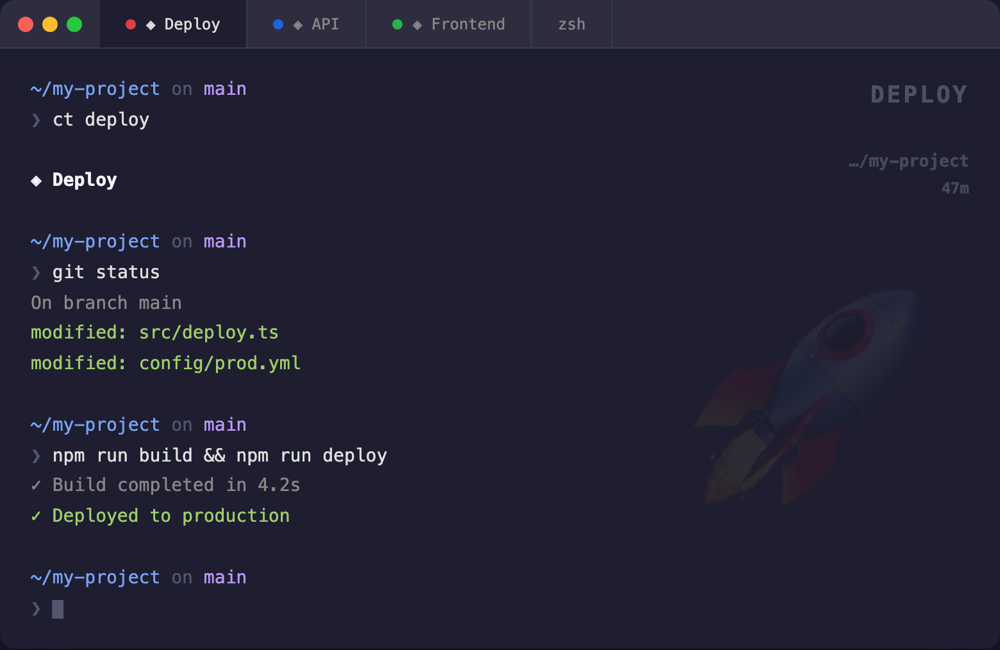
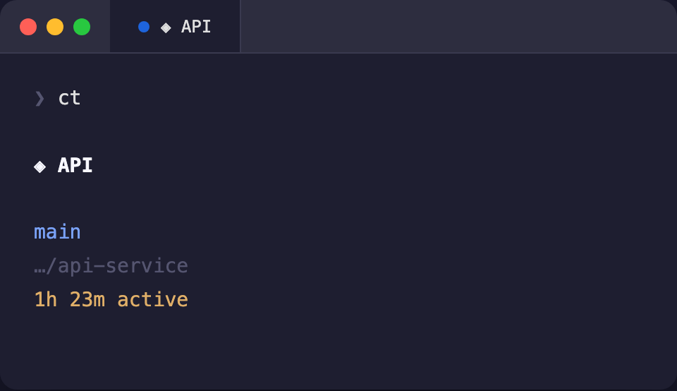
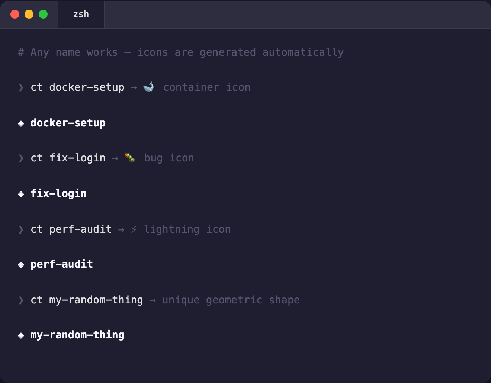
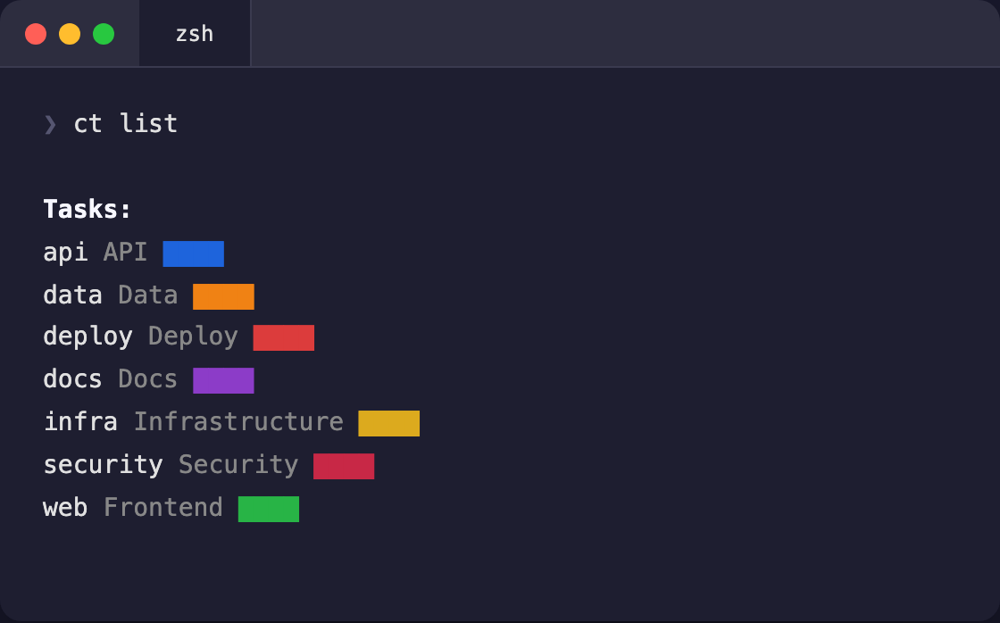
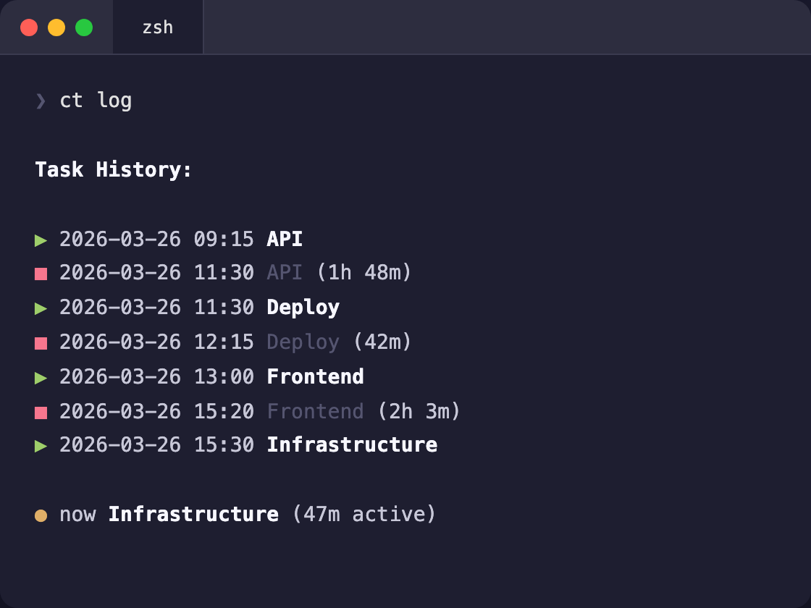

# ct — context tag

**Tag terminals, not tabs.**

You have 6 terminals open. You switch to one. Which project was this again?

`ct` solves this in one command — a persistent visual watermark that stays visible while you scroll, type, and forget which terminal is which.

```
ct deploy
```

A rocket icon fades into your terminal background. The tab turns red. A badge tracks your task name, directory, and active focus time. All persistent. All automatic.



---

## Install

```bash
git clone https://github.com/Lang-Julian/ct.git
cd ct && ./install.sh
```

**Requirements:** zsh, Python 3, [Pillow](https://pypi.org/project/Pillow/) (`pip install Pillow`)

Without Pillow everything still works — just no background images.

> **Full visual features** (background, badge, tab color) require [iTerm2](https://iterm2.com/) or [WezTerm](https://wezfurlong.org/wezterm/). Other terminals get the title, timer, task log, and ASCII art fallback. See [terminal support](#terminal-support) for details.

## Usage

```bash
ct deploy              # tag this terminal
ct                     # show current task + git branch + path + timer
ct clear               # reset everything
ct list                # show all tasks
ct delete <name>       # remove a cached icon
ct log                 # task history with durations
ct help                # full reference
```



## Smart icons

Any name works. `ct` generates an icon automatically on first use and caches it in `~/.ct/icons/`.

### Semantic matching

Your task name is analyzed against **160+ keywords** mapped to **25 icon shapes**:

```
ct deploy       → 🚀 rocket          ct auth-flow    → 🔒 padlock
ct fix-login    → 🐛 bug             ct k8s-debug    → 🐋 container
ct docker-setup → 🐋 container       ct perf-audit   → ⚡ lightning bolt
ct api-review   → 🔗 connected nodes ct email-thing  → ✉️  envelope
ct db-migration → 🗄️  database        ct git-rebase   → 🌿 branch
```



Three-pass matching ensures natural task names just work:

```
ct "deploy-to-prod"
     ↓
  Split: ["deploy", "to", "prod"]
     ↓
  Pass 1: exact word match     → "deploy" hits → 🚀
  Pass 2: substring match      → "deploying" contains "deploy"
  Pass 3: joined-string match  → "mydb" contains "db"
     ↓
  No match? → deterministic geometric shape (SHA-256 hash → color + shape)
```

Same name always produces the same icon. Deterministic, no randomness.

### Pre-built tasks

Seven tasks ship with hand-crafted icons:



| Command | Icon | Color |
|---------|------|-------|
| `ct deploy` | Rocket | Red |
| `ct api` | Connected nodes | Blue |
| `ct web` | Browser + globe | Green |
| `ct infra` | Server rack | Yellow |
| `ct security` | Shield | Crimson |
| `ct data` | Bar chart | Orange |
| `ct docs` | Document + pen | Purple |

Aliases: `site` and `frontend` → web

## Smart timer

The timer only counts **active focus time** — not wall clock time.

It ticks on each shell prompt. If the gap between two prompts exceeds the idle threshold, that gap is skipped — you were away.

```
22:00  ct deploy            timer starts
22:05  git push             +5m  (5m gap < 10m threshold → counted)
22:05  ... go to sleep ...
10:00  ls                   +0m  (12h gap > 10m threshold → skipped)
10:03  npm test             +3m  (3m gap → counted)

ct                          shows: 8m active (not 12h 3m)
```



Configurable threshold:

```bash
export CT_IDLE=300    # 5 min (stricter)
export CT_IDLE=900    # 15 min (relaxed)
# default: 600 (10 min)
```

## How it works

Three visual layers, all persistent across scrolling:

| Layer | Survives scrolling | Where | Requires |
|-------|-------------------|-------|----------|
| **Background image** | Yes | Terminal pane | iTerm2 or WezTerm |
| **Badge** | Yes | Semi-transparent overlay | iTerm2 or WezTerm |
| **Tab color** | Yes | Tab bar | iTerm2 or WezTerm |
| **Terminal title** | Yes | Title bar / tab | Any terminal |
| **ASCII art** | No (one-time) | Terminal output | Any terminal |

The badge updates on every prompt — automatically reflects directory changes as you `cd` around. No manual refresh, no background process.

## Terminal support

| Terminal | Background | Badge | Tab color | Title | Timer | Log |
|----------|-----------|-------|-----------|-------|-------|-----|
| **iTerm2** | ✓ | ✓ | ✓ | ✓ | ✓ | ✓ |
| **WezTerm** | ✓ | ✓ | ✓ | ✓ | ✓ | ✓ |
| **Terminal.app** | — | — | — | ✓ | ✓ | ✓ |
| **Alacritty** | — | — | — | ✓ | ✓ | ✓ |
| **Kitty** | — | — | — | ✓ | ✓ | ✓ |

Core features (timer, task tracking, log, title) work in **any** terminal. Visual features use iTerm2/WezTerm proprietary escape sequences.

## Configuration

### Custom tasks with fixed colors

Create `~/.ct/config.zsh`:

```zsh
_CT_TASKS+=(
    myapp     "My App;80;140;220;myapp"
    staging   "Staging;220;160;40;staging"
)
```

Format: `key "Label;R;G;B;icon_file"` — see [`config.example.zsh`](config.example.zsh).

### Background blending (iTerm2)

If the background watermark is too subtle or too strong:

**Preferences → Profiles → Window → Background Image → Blending slider**

## Architecture

```
ct.zsh         ~580 lines    Shell integration, timer, badge, CLI
gen-icons.py   ~560 lines    Icon generation (Pillow), semantic matching
install.sh      ~80 lines    One-command setup
```

- **Single file, zero runtime dependencies** — `ct.zsh` needs only zsh. Python + Pillow are optional (background images only).
- **precmd hook** ticks the timer and refreshes the badge every prompt — no polling, no daemon.
- **SHA-256 hash** → deterministic HSL color + geometric shape. Same input, same output, always.
- **Three-pass semantic matching** — exact word → substring → joined string → fallback. Covers natural naming ("deploying" → "deploy", "mydb" → "db").
- **Injection-safe** — task names are slugified before filesystem access. Colors computed via `sys.argv`, not string interpolation.
- **Graceful degradation** — no Pillow? Badge + tab color + ASCII art still work. Not iTerm2? Title + timer + log still work. Each layer fails independently.
- **Zero subshell overhead in hot paths** — slug computation, state updates, timer ticks are pure zsh builtins.

## Uninstall

```bash
rm -rf ~/.ct
```

Then remove from `~/.zshrc`:

```
[[ -f "$HOME/.ct/ct.zsh" ]] && source "$HOME/.ct/ct.zsh"
```

## License

MIT
